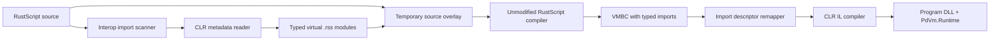

# Typed .NET Interop Wrapper Plan

## Implementation status

The typed wrapper pipeline is implemented in this repository. `PdVm.Runner compile-source` builds a temporary source overlay, generates concrete RustScript declarations for the selected profile, invokes the unmodified upstream compiler through the bundled native C ABI, remaps generated imports to versioned exact CLR descriptors, and lowers the result to CLR IL. The default runtime accepts these descriptors while name-based reflection requires the explicit experimental flag.

The common profile preserves compact names for Console, Math, Path, File, and StringBuilder. The Windows-only `winforms` profile provides WinForms wrappers and direct function-value event bindings. The Runner owns the calling STA thread and message loop; RustScript owns UI behavior through callable values passed to click, mouse, closing, and timer bindings. In addition, the wrapper scans reachable `use System::...` imports and generates typed bindings from the resolved CLR type metadata.

## Decision

The upstream RustScript compiler and Rust runtime remain unmodified. This repository owns a source-compilation wrapper that presents generated, typed RustScript modules to the upstream compiler and owns the CLR binding runtime used by the generated program.

Raw implicit host calls must not be enabled by the default host. They erase the callable signature and let overload selection drift to runtime. The supported path uses `use System::...` declarations, generated typed modules, and exact CLR binding descriptors.

## Invariants

1. The upstream compiler is treated as a versioned black box. Its source tree is never patched by this project.
2. Every CLR call visible to RustScript has a concrete RustScript parameter and return schema.
3. Every generated host import identifies one exact CLR constructor, method, property accessor, or approved adapter.
4. VMBC contains the return type emitted by the upstream compiler from the generated declaration.
5. The runtime never performs name-only overload discovery for typed imports.
6. Dynamic reflection, if retained for experiments, is opt-in and separate from the default Runner host.
7. Edge and other sandboxed hosts do not gain CLR reflection implicitly.

## User-facing model

The wrapper materializes virtual modules in an overlay source root. The source remains ordinary RustScript:

```rust
use System::Console;
use System::IO::Path;

Console::WriteLineString("hello");
let name = Path::GetFileName("scripts/main.rss");
```

The generated `System/Console.rss` module is conceptually:

```rust
pub fn __clr_b_17d84a(value: string) -> null;

pub fn WriteLine(value: string) -> null {
    __clr_b_17d84a(value);
}
```

`__clr_b_17d84a` is an internal symbol associated with one exact binding descriptor, for example `System.Console.WriteLine(System.String) -> System.Void`.

CLR objects use typed module functions rather than string-based instance dispatch:

```rust
use System::Text::StringBuilder;

let builder = StringBuilder::NewStringBuilder();
StringBuilder::AppendStringInstance(builder, "hello");
let text = StringBuilder::ToString(builder);
StringBuilder::ReleaseStringBuilder(builder);
```

The first version represents CLR references as checked integer handles. A later language-level opaque-handle schema can replace this without changing the binding descriptor format.

## Compilation pipeline



### 1. Import scan

The wrapper scans reachable `use System::...` directives. It resolves each concrete type against trusted platform assemblies and user reference DLLs, then materializes a matching typed `.rss` module. It does not parse or transform expressions. Normal RustScript syntax and type inference remain the responsibility of the upstream compiler.

The scan produces requested CLR type names and optional aliases. Imports outside the `System` root pass through unchanged. A missing type reports the source path and line, the requested CLR type name, and how to supply a third-party reference.

### 2. Metadata resolution

Use `System.Reflection.Metadata` and `PEReader` against reference assemblies or explicitly supplied assemblies. Metadata inspection must not execute target assembly code.

Resolution inputs are:

- trusted platform assemblies and the target runtime;
- DLLs beside the source, under the source root, beside the Runner, or in the current working directory;
- an interop profile for curated convenience APIs.

The result includes assembly identity, module MVID, type, member kind, static/instance flag, generic arity, exact parameter types, exact return type, and nullability where available.

### 3. Overload policy

RustScript does not provide CLR-style overload sets. The wrapper gives one deterministic preferred overload the short method name and gives additional compatible overloads deterministic type suffixes.

- A common profile preserves idiomatic names such as `Console.WriteLine(string)`.
- Metadata-generated modules use deterministic suffixes such as `WriteLineString` and `WriteLineInt` when more than one compatible overload exists.
- `ref`, `out`, pointer, byref-like, open generic, and vararg members are rejected initially.
- Generic catch-all declarations are not used because they hide the exact CLR contract.

Ambiguity is a compile-wrapper diagnostic that lists candidate signatures and the manifest entry needed to select one.

### 4. Type mapping

| CLR metadata type | RustScript schema | Runtime representation |
| --- | --- | --- |
| `void` | `null` | one RustScript `null` result |
| integral primitives | `int` | checked conversion to `i64` |
| floating primitives | `float` | `f64` |
| `bool` | `bool` | Boolean |
| `string`, `char` | `string` | UTF-8 string |
| `byte[]` | `bytes` | byte buffer |
| supported arrays/lists | `[T]` | RustScript array |
| supported dictionaries | `map<T>` | RustScript map |
| nullable/reference optional | `T?` where supported | value or `null` |
| other reference types | `int` initially | checked CLR object handle |

Conversions that lose range or precision are rejected unless the binding profile explicitly permits them.

### 5. Source overlay

The wrapper accepts a source root, copies or mirrors the RustScript module tree into a temporary overlay, and writes generated modules under `System/...`. The user's source tree is never modified.

The bundled `pd-vm-compiler` cdylib runs against the overlay and calls the upstream compiler API in-process. It pins an upstream compiler commit, disables the upstream runtime/CLI/JIT features, and exports a small C ABI for compilation and buffer release. The C# wrapper invokes that ABI with P/Invoke; no compiler process is launched.

### 6. VMBC remap

Generated external declarations use identifier-safe names such as `__clr_b_<hash>`. After reading VMBC, the wrapper verifies every such import against its binding table and replaces it with a versioned exact descriptor before calling `PdVmClrCompiler`.

The descriptor should be deterministic and self-contained, for example a compact base64url encoding of:

```text
v1 | assembly identity | MVID | type | member kind | member | parameter types | return type
```

The descriptor is carried in the generated assembly's import table, so no mutable process-global registration or sidecar file is required.

### 7. Runtime binding

`PdVmDotNetHost` resolves versioned descriptors by default. It verifies assembly identity, MVID, type, exact member signature, parameter types, return type, static/instance mode, and conversion rules before invocation.

The name-based reflection prototype is retained for experiments behind `--enable-dynamic-dotnet`. It is disabled in the default fallback host.

Object handles are owned by one execution host, include generation checks, and are released deterministically. `IDisposable` values are disposed on release and when the host is disposed.

## Common library profile

The initial profile should be explicit and small:

- `System.Console`
- `System.Math`
- `System.Convert`
- `System.Environment`
- `System.IO.Path`, `File`, and `Directory`
- `System.Text.StringBuilder`, `Encoding`, and `Regex`
- selected collection helpers

Adding a profile entry requires a typed declaration golden test, an exact descriptor test, conversion tests, and an end-to-end source test.

## Windows Forms profile

Windows Forms is a separate Windows-only profile loaded from `Microsoft.WindowsDesktop.App`.

The supported surface includes constructors, primitive properties, control collections, dialogs, deterministic disposal, and the callable `EventLoop` bridge. The Runner uses its calling STA thread for this profile.

Typed WinForms calls execute directly on the owning STA thread. `EventLoop` receives an RSS callable value as a typed host argument, converts payload-bearing UI events into immutable `map<string>` snapshots, and enqueues that callable through the Program FIFO gate. The form's `BeginInvoke` schedules queue draining after the current event returns, so generated code is never re-entered from a CLR event stack. Modal dialogs and callback-driven control updates remain on the same UI thread and inherit its PerMonitorV2 DPI context. There is no process-wide hidden form, dedicated UI thread, or polling `Wait` loop.

## Project layout

```text
PdVm.Interop.Metadata/       metadata reader, profiles, descriptors, module generator
PdVm.SourceCompiler/         wrapper pipeline and upstream compiler adapter
PdVm.Runtime/                exact descriptor invocation and object handles
PdVm.Runner/                 compile-source, compile, run, and compile-run commands
PdVm.Interop.Tests/          golden modules, metadata, negative typing, E2E, WinForms
interop-profiles/common.json
interop-profiles/winforms.json
```

## Delivery phases

1. Add descriptor and type-mapping models plus common-profile metadata tests.
2. Generate typed `.rss` modules and golden-test their source.
3. Add `PdVm.Runner compile-source <input.rss> <output.dll>` around the unmodified compiler.
4. Remap internal VMBC imports to exact descriptors and remove default dynamic fallback registration.
5. Implement exact static calls, constructors, instance methods, properties, and handle lifetime.
6. Add common-library end-to-end tests, including negative compile-time type tests.
7. Add the Windows Forms profile, STA execution, and a non-blocking UI construction test.
8. Add richer event adapters after callback queue semantics are validated for each control family.

## Completion gates

- The upstream RustScript repository remains byte-for-byte clean after all tests.
- `Console.WriteLine(123)` fails at compile time when only the string overload is selected.
- `Console.WriteLine("ok")` produces a VMBC import with `Null` return type.
- Returned values such as `Path.GetFileName` have concrete RustScript types without local annotations.
- Runtime invocation resolves the exact descriptor and performs no name-only overload search.
- Common-profile and WinForms tests pass without enabling CLR reflection in `PdEdge.Http`.
- The generated program DLL runs with only its declared runtime artifacts.
